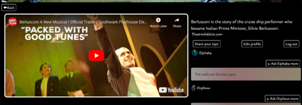

# Theatre Addict - Musical Theatre App

## General Assembly Project Four

The idea for this project was to create an app which would be very mobile-friendly, and would allow the user to swipe through all musicals on show in the West End, and then go through and book these. I also added the capacity to leave tips for other theatre-goers (such as the best times to go to see a show), and then also the ability to send messages to others who have left advice about a specific show. 

### Deployment link

https://theatre-addict.herokuapp.com/ - Deployed project
https://github.com/hannahbodey/Theatre-trips-tool - Git repo
To access all features, you can use the following account to log in:
Email: fagin@email.com
Password: faginoliver

### Timeframe & Working Team

This was a solo project, completed in the final week and a half (weeks 11-12) of the General Assembly software engineering course. 

### Technologies Used
 
*Back End:

Python
Django
Django REST Framework
PostgreSQL
JSON web tokens

*Front End:

JavaScript
React
HTML
CSS
Sass

*Development Tools:

Excalidraw
Trello
Table Plus 

### Brief

-Build a full-stack application (making your own front- and back-end)
-Use a Python Django API, using Django REST Framework to serve data from a PostgreSQL database
-Consume your API with a separate front-end built with React
-Be a complete product (multiple relationships, CRUD functionality)
-Have a visually impressive design

### Planning

The whole idea for this project relied on being able to see a range of musicals and having comments / tips provided by different users. To help me build this up, I drew out the database and the interconnecting relationships. I used several many-to-many relationships on the musicals between musicals and genres / price ranges to ensure that each musical could have multiple genres (as most musicals do!), as well as tickets at a range of prices. I also had several one-to-many relationships with the user and musical in order to add theatre tips for an individual musical. This was because it’s important that any one tip cannot relate to more than one musical, and can only have one owner. 

 
I finished the original MVP quite quickly, and decided to add some further functionality in the form of messages sent between users, and for this I created a second database model:

 
There needed to be dual relationships here because the current user needed to be able to add a message but the message also needed to have a recipient field, which would be another user. 

Having planned out the database, I built a wireframe for my project. The aim was to have an immersive experience, which was very visually rich and enticing. I wanted to start with theatre curtains that opened and allowed the user to ‘walk’ in through to the musicals available. The user should then see all musicals available. I had planned for there to be a filter on if the user wanted ‘happy’ or ‘sad’ musicals which would be filtered based on the musical’s genre, but there weren’t enough ‘sad’ musicals for this to be practicable. I therefore went straight to a carousel of musicals that would entice the user. The user could then click through to see the YouTube trailer of the musical and comments / descriptions about each musical. There should also be a banner image behind the title of the musical in order to make it visually appealing. I also wanted to ensure that there were links to the website to buy tickets for the production, in order to close the loop between searching for a show and organising a trip to the theatre.
 

 
Initially, I considered the profile view / update profile option to be a bonus page where you could update your user image / username or email etc.:
 

I also used Trello to monitor tasks to complete, and had it split up based on the back-end / front-end / bonus features:

 
To see the wireframe in detail, please click this link: https://www.figma.com/file/N7L0BqL9s9qxPRh0MjEk3z/Theatre_trips_tool?node-id=0-1&t=ms39yBgTpWnResGb-0 

### Build/Code Process

I started by working through the back-end of my project, building up the various models and views. I wanted to ensure that all views were working before starting to connect the front-end, which is something that I tested using Insomnia. 

One key view that I implemented was the register new user view. Not only does this view register the new user, it also immediately logs them in. This meant that the view needed to have the ability to pass through the token to the user in order for it to be saved to local storage:
 

As stated elsewhere, a major element of this project was the user experience. Therefore, the rest of the build process section will feature excerpts from my front-end code. 

To achieve the curtains-opening effect seen on the home page, I used a gradient across a div to make the colouring look like folds of cloth, and then used animation to pull the two curtains back at the same time:
 

 
The translation of the panels to give the drawing-back effect involved adding a checkbox to the whole homepage, which then had to be deactivated on one click, so that the user could click the ‘come on in’ button without it just closing the curtains again:
 

 

It was also very important for this app to work on mobile as well as desktop. Therefore, I ensured that various elements were visible / sat differently on the page based on the screen size. Given that there are so many different screen sizes, this involved providing many different rules for the positioning of the comments box on the single-musical page:
 

I’m sure that there is a more efficient way of doing this, but this is what I came up with for this project.
For example, on the desktop view, the comments section sits next to the video:

 
On mobile, it moves to sit underneath the video:

 
I also ensured that the comment box height was capped and allowed for scrolling so that it all sat neatly next to or under the video container. 

An area that required some logic to function correctly was the messaging system. Initially, on posting a message, it would offer the option to send a message to yourself as well as other users - this was not quite the idea, so I saved the current user to local storage on log in, along with their token, and used this to check if the sender of the message was the current user or not. If not, the current user was offered an option to send a new message to the message sender:
 

### Challenges

There were a couple of key challenges:
-	Storing the data for the musical at which you were looking before clicking to add a new comment took some time to solve. To do this, I saved the previous page in local storage and used this to navigate back to the previous page.
-	I also had some issues with mapping through comments / messages, and this resulting in all message boxes being given a messaging form option on clicking the ‘reply’ button. This was happening because I was mapping through each comment, and had the form on the bottom of the map, so I ended up moving it, which meant that it could no longer sit next to the appropriate message, so I instead converted this message send form to be set to an absolute position that floated above the messages, and only appeared if the user, stored in local storage, was matching as the recipient of that message. 

### Wins

There were key goals for this project that I wanted to meet:
-	I really wanted to have a set of opening curtains to greet the user and make them feel as though they were stepping into a theatre (virtually, of course). I was pleased to get these working and looking as much like curtains as possible with the time limit and working on the functionality of the rest of the project.
-	I wanted this to be very mobile responsive, because it is supposed to be swiped through just like a dating app, where you are searching for your theatre match.
-	Ensuring that the user was logged straight in on registering a new account, and also that once they had logged in, they were taken straight back to the musical page where they had been about to make a comment, was very important to my user journey. I used local storage to achieve the control over which component was shown, and this successfully and smoothly controlled the user’s placement on the site. I also wanted to ensure that the musicals could all be viewed without a user logging in, in order to improve the user journey through the site. 
-	I also only decided to add the messaging feature on the penultimate day of the project, so I was very pleased that I got it completed and working within one day.

### Key Learnings/Takeaways

There are a few key things that I learnt whilst doing this project:
-	As stated above, I used local storage quite a lot in order to support movement between specific musical pages and user pages, and this was very useful for ensuring that the user journey made sense.
-	I had some issues connecting my front- and back-end when it came to connecting certain populated models, since I had used snake case in my Python and camel case in my JavaScript. This meant that, when deconstructing from calls to my back-end, my front-end sometimes gave an error because it couldn’t accept the snake case. I therefore had to go back and change all my instances of snake case use where it was going to need to be called in the front end - for example, price_range had to become pricerange.
-	I used multiple components (such as a carousel) and also a lot of logic to ensure that messaging was only possible for the current user to other senders, not themselves, for example. 
-	Another key takeaway from this project was building appropriate relationships and ensuring that these were located on the appropriate models. 

### Bugs

There are a few things that I would want to iron out on this project:
-	I set the messaging form to disappear after 10 seconds, since it wasn’t intuitive to click the ‘Ask x user more’ for a second time after sending the message. I wanted this to disappear more quickly, but unfortunately it starts the first countdown on the initial rendering of this component, and so I had to make the interval longer to stop it cutting out as you were typing your message. Ideally, this message form option should only start to disappear when the ‘send message’ button has been hit.
-	The React carousel component that I used always goes back to the first image when clicking between different pages, so even if you click back from a specific musical, it always takes you back to the first image. I couldn’t find a way to overcome these settings on this component. It also flicks through all images when it goes from the final image back to the first one, instead of having a smooth sliding effect.

### Future Improvements

In order to improve this site, I would:
-	Add a liked musicals section on your profile, so that each user could save and store musicals that they had seen / wanted to see.
-	Add a messages notification section, to show the user if they have received a new message. Currently, your messages only show on the ‘edit profile’ page.
-	Add a messaging styling system that allows you to filter messages by the sender so that they don’t all show at once, and also setting dates on the messages so that it’s more comprehensive for the user to read. It would be amazing to add a ‘type your message’ box that automatically sends to a certain user in a thread, which would make it more straightforward.
